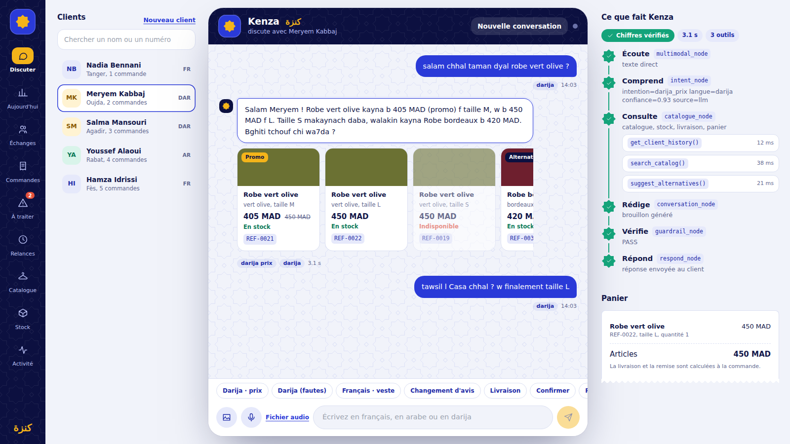
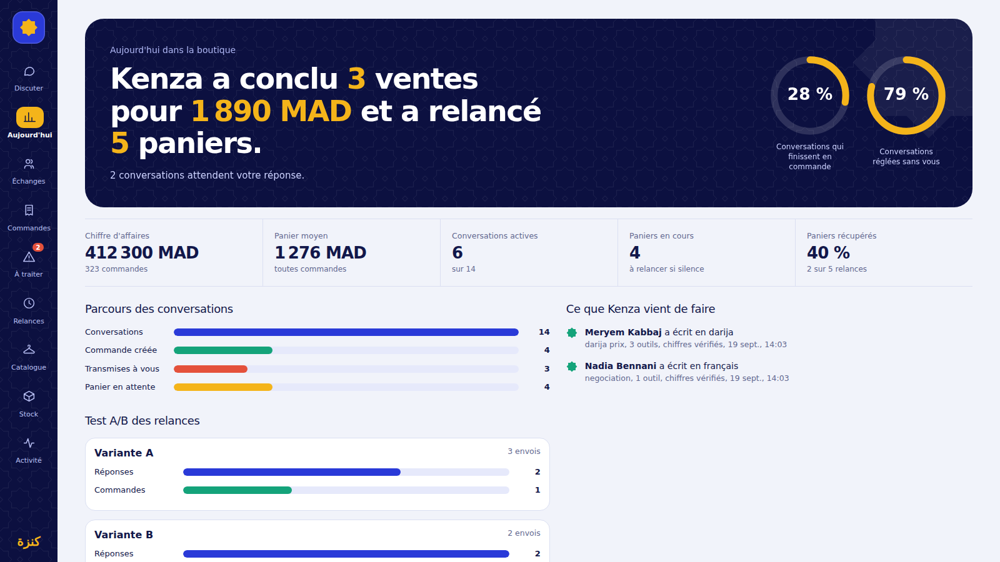

# Kenza — l'agent commercial qui vend vraiment (#NumeosHack26 · Sujet 02)

> **État de vérification, en toute transparence.** Le code a été assemblé dans un environnement *sans Docker, sans PostgreSQL, sans Redis et sans accès au LLM*.
> Vérifié par exécution : compilation TypeScript stricte (API + worker + agent + web), **153 assertions unitaires** (règles métier, garde-fou, routage du graphe, horaires/A-B des relances).
> Vérifié lors d'une session précédente sur PostgreSQL 16 + Redis 7 : seeder (80/120/320/449/12/12) et **37 tests d'outils** (`npm run test:tools`, dont la concurrence sur la dernière unité).
> **Non exécuté ici** : `docker compose up`, le graphe avec le vrai LLM, le worker sur Redis, le replay des 40 conversations, le build Vite. La section [Vérifier en 5 minutes](#vérifier-en-5-minutes) donne les commandes exactes.

## 1. Problème
Un commerçant marocain reçoit 150 à 300 messages/jour (« chhal taman ? », « vous livrez à Fès ? »). Il répond le soir, le client a acheté ailleurs, et personne ne relance les paniers abandonnés.

## 2. Solution
Kenza est un agent autonome branché sur la conversation : il comprend (fr / ar / darija, fautes comprises), cherche dans le **vrai** catalogue, vérifie le **vrai** stock, calcule la **vraie** livraison, gère le panier, **crée la commande en base**, relance les paniers abandonnés via BullMQ, et **transfère à l'humain avec le contexte complet** dès qu'il sort de son domaine.

## 3. Architecture

```
React (chat WebSocket + dashboard) ──► Fastify ──► LangGraph StateGraph ──► Tools (10, déterministes) ──► PostgreSQL
                                          │                 │                                               ▲
                                          │                 └── checkpointer PostgreSQL (mémoire longue)     │
                                          └── Redis (état court, cache intention) ── BullMQ ── Worker ───────┘
```

| Rôle | Où |
|---|---|
| **LLM** = moteur de langage (endpoint OpenAI-compatible, aucun code fournisseur) | `packages/agent/llm.ts` |
| **Agent** = LLM + instructions + état + outils | `packages/agent/nodes/*` |
| **Orchestrateur** = contrôle du workflow | `packages/agent/graph.ts` (LangGraph.js) |
| **Tool** = fonction déterministe qui lit/écrit PostgreSQL | `packages/agent/tools/*` |
| **Base** = source de vérité | `packages/db/schema.sql` |

Le LLM n'accède jamais à la base ; il ne choisit que *quel tool appeler*. Prix, stock, frais, délais, totaux, remises et création de commande sont calculés **en code**.

### Graphe LangGraph

```
START → multimodal ─(panne STT/vision)──────────────────────────► escalation → END
            └────► intent ─(règle d'escalade : ICE, réclamation, remise>10 %, ville inconnue, réassort…)► escalation
                     ├─(inconnu / confiance faible)────► conversation   (question de clarification)
                     └─(besoin métier)──► catalogue ─(tool impose escalade)► escalation
                                             └──► conversation ─(LLM KO)► escalation
                                                       └──► guardrail ─ PASS ─► respond → END
                                                                 ├─ FAIL (1er) ─► conversation (retry unique)
                                                                 └─ FAIL (2e) ──► escalation → END
```
`relance` vit dans le **worker** (`nodes/relance_node.ts`), hors boucle synchrone.

| Nœud | Responsabilité |
|---|---|
| `multimodal` | audio → STT (`/audio/transcriptions`) ; image → vision → attributs → recherche catalogue (jamais de référence devinée, confirmation demandée) ; panne → dégradation propre + escalade |
| `intent` | 18 intentions + langue + difficulté, JSON validé par Zod ; règles déterministes prioritaires sur le LLM ; confiance < 0,5 → `inconnu` |
| `catalogue` | étapes déterministes (historique, livraison, remise plafonnée, alternative garantie en cas de rupture) + boucle de tool-calling LLM ; produit les `facts` sourcés |
| `conversation` | rédige **uniquement** à partir des `facts` validés, dans la langue du dernier message |
| `guardrail` | tout nombre doit être justifié par un fact ; refs inventées, COD non autorisé, réassort, remboursement espèces, remise > plafond → rejet, 1 retry, puis escalade |
| `escalation` | crée l'escalade (motif + contexte complet), répond par un message sûr trilingue sans chiffre |

### Zéro hallucination métier
Chaque tool écrit des `facts` `{type, value, source: "db:…", ref}`. Le guardrail relit le **texte final** et refuse tout nombre non justifié (`packages/agent/guardrails/guardrail.ts`, testé dans `guardrail.test.ts`). Le plancher de remise (10 %) est dans `apply_discount` ; `create_order` relit panier/remise/frais en base et ne fait jamais confiance au LLM. Aucune date de réassort n'est jamais annoncée (`delai_reassort_jours` n'est lu nulle part côté réponse).

### Mémoire
- **Courte** : Redis (`memory.ts`) + cache des classifications d'intention.
- **Longue** : checkpointer PostgreSQL LangGraph ; `thread_id = client_id` (ou téléphone). Un même client qui revient dans une **nouvelle conversation**, même après `docker compose restart`, retrouve son fil + son historique de commandes (`get_client_history`).
- Panier et remise vivent en base (`conversations.cart`) : « finalement L » modifie le panier (`change_size`), ne repart pas de zéro.

### Relances (EX-05)
`scanAbandonedCarts` (job scheduler BullMQ, toutes les 15 s) sélectionne les conversations avec panier non converti, silencieuses depuis > 24 h (`DEMO_DELAY_MINUTES=1` → 1 min), non reprises par un humain, **jamais relancées**. Le job `send-relance` est retardé jusqu'à l'ouverture (lun→sam 10h-20h, fuseau Africa/Casablanca) — la relance nocturne est reportée. `relance_node` re-tarife le panier en base, ignore les articles épuisés, choisit A/B de façon déterministe, personnalise dans la langue du client (reformulation LLM contrôlée, repli sur gabarit) et journalise dans `relances`. Le résultat (`sent → replied → converted`) alimente l'A/B du dashboard.

## 3 bis. Design : identité « Majorelle »
Bleu de jardin, safran et plâtre à la chaux ; un seul motif, l'**étoile à 8 branches du zellige (khatam)**, qui sert de logo, de fond de conversation et de nœud du graphe.
- **Le cerveau de Kenza** (`AgentGraph.tsx`) : le vrai graphe LangGraph rendu en direct. Chaque étoile s'allume quand le nœud vient réellement de s'exécuter (événements WebSocket), avec les outils appelés, leurs arguments et résultats, et le sceau « Chiffres vérifiés » du garde-fou.
- **Cartes produit** (`ProductCards.tsx`) construites uniquement à partir des résultats d'outils (prix promo barré, stock, alternative en cas de rupture).
- Réponses révélées mot à mot, texte bidirectionnel (`dir="auto"`) pour l'arabe, ticket de panier, tableau « Aujourd'hui » (phrase-bilan, anneaux, parcours des conversations, test A/B).
- Accessibilité : focus visible, `prefers-reduced-motion` respecté, responsive jusqu'au mobile. Polices Google Fonts avec repli système.




## 4. Installation

```bash
cp .env.example .env          # renseigner LLM_BASE_URL, LLM_API_KEY, LLM_MODEL
docker compose up --build
```
Web client : http://localhost:5173 · Dashboard commerçant : http://localhost:5173/?mode=merchant · API : http://localhost:4000/health. Le client dispose du chat, du catalogue, du stock et de son historique de commandes ; le dashboard commerçant expose les conversations, commandes, relances, escalades et traces agent. Le schéma et le seeder s'exécutent automatiquement au démarrage de l'API (idempotent ; **FAIL FAST** si les volumes ≠ 80/120/320/449/12/12). Les fichiers de `data/` ne sont jamais modifiés (montés en lecture seule).

Variables : voir `.env.example`. **Ne commitez jamais `.env`.**
Démo de nuit : `DEMO_IGNORE_SHOP_HOURS=1` désactive uniquement le report aux horaires d'ouverture.

## 5. Tests

```bash
npm run typecheck        # TypeScript strict : agent, API, worker, web
npm run test:unit        # règles (54), guardrail + routage (51), horaires/A-B (9) — sans base ni LLM
npm run test:tools       # 37 tests d'outils sur PostgreSQL (base seedée requise)
npm run test:replay      # rejoue les 40 conversations avec le vrai LLM, assertions programmatiques
```
`test:replay` vérifie sans jamais demander au LLM si une réponse est « correcte » : intention ≥ 85 %, langue, aucun nombre hors facts, rupture → alternative en stock, aucun réassort, remise > 10 % → escalade, ville inconnue / ICE / réclamation / remboursement espèces → escalade, changement de taille → panier mis à jour. Rapport : `replay-report.json` ; les commandes/stock de test sont annulés.

### Vérifier en 5 minutes
```bash
docker compose up --build -d && docker compose logs api | grep "\[seed\]"     # 80/120/320/449/12/12
docker compose exec api npm run test:tools && docker compose exec api npm run test:replay
```

## 6. EX-01 → EX-08

| Exigence | Comment la démontrer |
|---|---|
| EX-01 | Simulateur → client → « salam chhal taman dyal robe vert olive ? » → ville → « oui c'est bon » |
| EX-02 | Panneau « Trace de l'agent » : `search_catalog()`, `check_stock()`, `get_price()`… avec arguments/résultats ; aucun catalogue dans les prompts |
| EX-03 | Onglet **Commandes** → filtre « Kenza uniquement » (`created_by = agent`) ; ou `SELECT * FROM orders WHERE created_by='agent'` |
| EX-04 | Discuter, `docker compose restart`, « Nouvelle conversation » avec le même client : historique rappelé |
| EX-05 | Laisser un panier 1 min → onglet **Relances** + message « Relance automatique » dans le chat (BullMQ → worker → `relances`) |
| EX-06 | « Facture avec ICE », « 30 % ou j'achète ailleurs », « Essaouira » → onglet **Escalades** (contexte complet, *Reprendre la main*) |
| EX-07 | **Vue d'ensemble** : conversations, conversion, commandes, escalades, CA agent, A/B |
| EX-08 | Trois scénarios en fr / ar / darija (bouton « Darija (fautes) » : `ch7al taman had sac kain f stock 3afak`) |

## 7. Script de démo (2 min)
1. *Darija* : « salam chhal taman dyal robe vert olive ? » → trace : intent → search_catalog → check_stock → get_price → guardrail PASS.
2. Taille + « tawsil l Casa » → frais/délai issus de `shipping_rates`. « Finalement L » → panier recalculé.
3. « Oui c'est bon, à la livraison » → commande créée → onglet Commandes (`agent`).
4. Rupture : « Vous avez la REF-0019 ? Quand est-ce que ça revient ? » → alternative réelle, **aucune date**, escalade.
5. « 30 % sinon j'achète ailleurs » puis « facture ICE » → Escalades → *Reprendre la main*.
6. Panier laissé 1 min → relance dans le chat + onglet Relances. Fin sur *Activité agent*.

## 8. Limites connues
- Le graphe complet n'a pas été exécuté contre le vrai endpoint LLM dans l'environnement de génération : les ajustements de prompts après `test:replay` sont probables.
- STT : suppose `/audio/transcriptions` sur l'endpoint ; sinon dégradation propre + escalade (le MVP texte n'est pas affecté).
- Le web tourne en mode dev Vite (suffisant pour la démo). WhatsApp Cloud API non branché : abstraction de canal = simulateur WebSocket (`ws.ts`).
- Les tests de concurrence des outils exigent PostgreSQL.

## 9. Bonus livrés
Notes vocales (STT), reconnaissance d'image (vision → catalogue), négociation encadrée (plancher en code), A/B automatique des relances.
